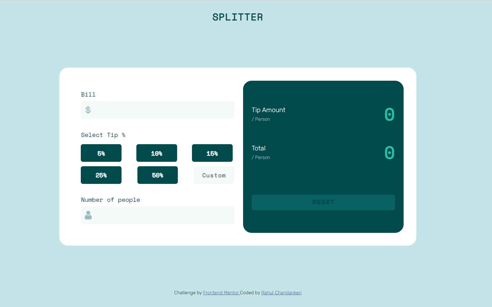

# Frontend Mentor - Tip calculator app solution

This is a solution to the [Tip calculator app challenge on Frontend Mentor](https://www.frontendmentor.io/challenges/tip-calculator-app-ugJNGbJUX). Frontend Mentor challenges help you improve your coding skills by building realistic projects.

## Table of contents

- [Overview](#overview)
  - [The challenge](#the-challenge)
  - [Screenshot](#screenshot)
  - [Links](#links)
- [My process](#my-process)
  - [Built with](#built-with)
  - [What I learned](#what-i-learned)
- [Author](#author)

## Overview

It is a tip calculator , Which calculates tip/person and total bill

### The challenge

Users should be able to:

- View the optimal layout for the app depending on their device's screen size
- See hover states for all interactive elements on the page
- Calculate the correct tip and total cost of the bill per person

### Screenshot

### Links

- Solution URL: [https://github.com/Rahulchandankeri/Tip-calculator-app]
- Live Site URL: [https://rahulchandankeri.github.io/Tip-calculator-app/]

## My process

### Built with

- Semantic HTML5 markup
- CSS custom properties
- Flexbox
- Mobile-first workflow

### What I learned

- Learnt how to receive function from input
- Invoking function
- Great experience!

## Author

- Website - [Rahul Chandankeri](https://rahulchandankeri.github.io/portfolio/)
- Frontend Mentor - [@Rahulchandankeri](https://www.frontendmentor.io/profile/Rahulchandankeri)
- Github - [@Rahulchandankeri](https://github.com/Rahulchandankeri)
